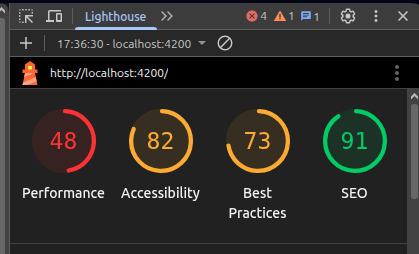

# InternalToolsFront

This project was generated using [Angular CLI](https://github.com/angular/angular-cli) version 21.2.1.

## 🚀 Quick Start

Le projet nécessite un `npm install` pour installer les différentes dépendances.

Une fois celles-ci installée, la commande `ng serve` permet de lancer application.

Une fois le serveur démarré, ouvrez votre navigateur et rendez-vous à l'adresse :  `http://localhost:4200/`.
L'application redémarre automatiquement lorsque les fichiers sources sont modifiés.

## 🏗️ Architecture

Le projet est découpé en composants : `components`, `services` et `models`.
Les `components` regroupent toutes les pages de l'application (page d'accueil, page des tools, etc.).

`services` contient les différentes fonctions permettant d'appeler le back-end et récupérer les données voulues.

`models` est le dossier où se trouvent les interfaces qui illustrent le format des données attendu.

Le dossier `utils` contient quelques fonctions utiles mais non liées au projet (par exemple, un tri par ordre alphabétique ou un pipe pour que la première lettre du mot soit en majuscule).

Le fichier `app-routes.ts` est celui qui contient les différentes routes de l'application.

### Déroulé

J'ai commencé par créer tous les fichiers squelettes puis me suis attelée à la barre de navigation : commune à toutes les pages.
Une fois celle-ci réalisée (ou en tout cas avec essentiellement du fignolage à finir), j'ai réalisé la page d'accueil "Dashboard" car elle est la première à s'afficher à l'utilisateur.

Ensuite j'ai développé un petit composant réutilisable, présent dans la page d'accueil, qui affiche un tableau des outils récents. Ce composant est réutilisé dans la page consacrée aux tools.

Puisque c'est un composant unique, il n'y a pas de risque d'incohérence entre les deux pages.

Ensuite j'ai parfait le visuel avec Tailwind et mis un minimum de responsive design.

J'ai aussi mis en place de la data récupérable lors du changement de page pour que l'application puisse savoir précisément quelle page est affichée et reporter cette information sur la barre de navigation.

## 🎨 Design System Evolution

Le design a d'abord été très sommaire : l'affichage des informations était prioritaire.

Puis il y a eu la phase de familiarisation avec l'outil TailWind (personnellement habituée à l'outil Bootstrap).

Je me suis basée sur le mock-up fourni pour le choix des couleurs et des formes. Jusqu'à retrouver les références exactes des couleurs vert, bleu, orange et rose.

## 🔗 Navigation & User Journey

Flow utilisateur complet : Dashboard → Tools → Analytics
Le `Dashboard` affiche un aperçu des informations disponibles pour l'utilisateur : un résumé des KPI's principales ainsi qu'un tableau des outils les plus récemments mis à jour.

La page `Tools` affiche un tableau de la totalité des outils, pas seulement les plus récemment mis à jour.

La page `Analytics` n'a pour le moment pas d'utilité réelle avec les informations fournies. Ce serait une simple répétition des informations affichées sur le Dashboard. C'est pour quoi un simple Lorem ipsum est affiché.

## 📊 Data Integration Strategy

Gestion des données du JSON server à travers les pages
Les `services` sont des fonctions utilisées justement pour collecter les données nécessaires aux pages.

Chaque type de données (Tools, Analytics, Users, etc.) a son propre fichier service qui gère les appels API.
Les interfaces permettent de découper les données recueillies pour un affichage propre en html.

## 📱 Progressive Responsive Design

Le mock-up étant design pour un affichage navigateur, les pages n'ont pas été developpé dans une optique idéale.

Dans une approche parfaite, le mock-up aurait été aussi disponible en format mobile.

Cependant, grâce à l'outil TailWind, les adaptations pour un affichage mobile ont pu se faire assez rapidement.
Un burger menu pour la barre de navigation sur mobile.
Sur le Dashboard, les cartes de KPI's se répartissent sur la surface d'affichage disponible et le tableau reste lisible. L'utilisateur doit seulement scroll sur les côtés pour voir les autres parties du tableau.

## 🧪 Testing Strategy

Tests unitaires et stratégie QA sur l'ensemble
Les fichiers en `.spec.ts` servent au testing de l'application.
La stack de test classique d'Angular est :

- Jasmine pour les tests unitaires, même si Jest peut être utilité
- Karma pour lancer les tests sur navigateur.
- TestBed pour tester les composants et services.

## ⚡ Performance Optimizations

Techniques utilisées pour une app 3-pages optimale
L'extension `LightHouse` disponible dans les extensions Chrome a permis de tester les performances de l'application.
Celles-ci restent à améliorer : l'extension a donné un score de 48 en performances.

## 🎯 Design Consistency Approach

Le fichier `style.css` à la racine du projet contient toutes les couleurs, définies par des variables, pour utiliser la même teinte pour chaque composant.
Si des petits composants tels qu'une pagination étaient nécessaire sur plusieurs pages, ces composants seraient créés à part et appelé dans les pages concernées. Ceci pour maintenir une cohérence visuelle, éviter des erreurs et éviter des duplications de code.

## 📈 Data Visualization Philosophy

Choix de charts library et intégration design system

## 🔮 Next Steps / Complete App Vision
- Branchement de la barre de recherche avec une fonction adaptée (recherche suivant où on se situe)
- Ajout de tests
  - Test unitaires
  - Tests de non-regression
  - Tests end-to-end
- Ajout d'une authentification pour avoir un Dashboard personnalisé et avec seulement les données nécessaires à l'utilisateur
- Ajout d'un thème de couleur sombre 
- 

---
Framework: Angular
sytling : Tailwind css
icons lucide / heroicons
typography : inter
Routing : Angular Router
state management -> angular services + RxJS
api handling -> angular HttpClient
build tool -> angular cli (basé sur esbuild / vite-like)
charts: chart.js
